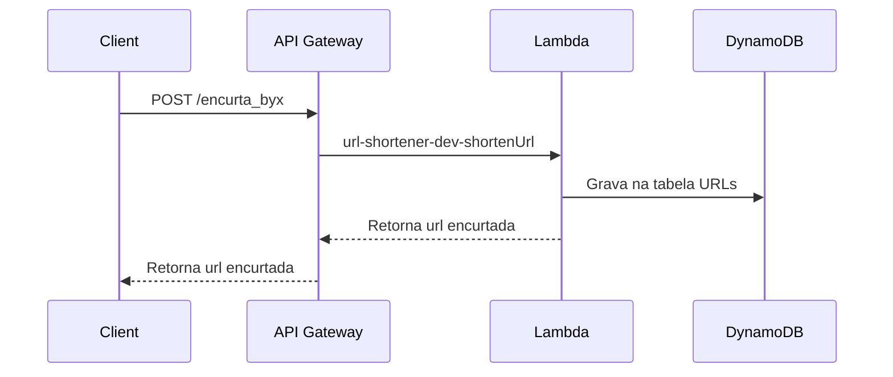
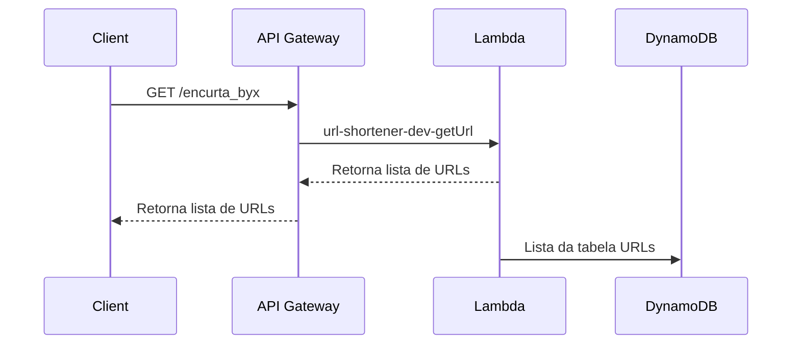
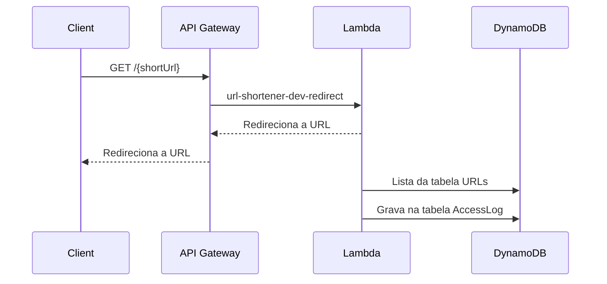
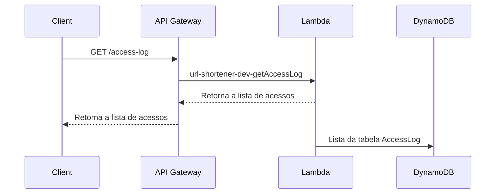

# Encurta Byx

Este é um projeto de encurtador de URL implementado em Node.js e Serverless Framework.

## Instalação

1. Certifique-se de ter o Node.js instalado em máquina.
2. Instale o Serverless Framework globalmente executando o seguinte comando:
   ```
   npm install -g serverless
   ```
3. Clone este repositório.

4. Navegue até o diretório do projeto:

   ```
   cd url-shortener
   ```

5. Instale as dependências do projeto:

   ```
   npm install
   ```

6. Instale o [AWS CLI](https://docs.aws.amazon.com/cli/latest/userguide/getting-started-install.html) e configure as credenciais.

   ```
   aws configure

   ```

## Testes

Para executar os testes unitários, execute o seguinte comando:

```
npm run test
```

## Implantação

Para implantar a aplicação, execute o seguinte comando:

```
npm run deploy
```

Na AWS deverá ser criado as tabelas `Urls` e `AccessLog` no `DynamoDB` e as funções Lambdas com seus respectivos API Gateway:
**OBS:** Talvez será necessário ajustar as permissões de acesso das `Lambdas` direto pelo painel da AWS.

## Endpoints

- **Endpoint:** `POST /encurta_byx`
  - **Lambda:** `url-shortener-dev-shortenUrl`
  - **Descrição:** Encurta uma URL longa para uma URL curta personalizada.



- **Endpoint:** `GET /encurta_byx`
  - **Lambda:** `url-shortener-dev-getUrl`
  - **Descrição:** Obtém a lista de URLs encurtadas



- **Endpoint:** `GET /{shortUrl}`
  - **Lambda:** `url-shortener-dev-redirect`
  - **Descrição:** Redireciona o usuário para a URL original associada à URL curta.
  - **Parâmetros da URL:**
    - `shortUrl`: A URL curta a ser resolvida.



- **Endpoint:** `GET /access-log`
  - **Lambda:** `url-shortener-dev-getAccessLog`
  - **Descrição:** Obtém o registro de acesso das URLs encurtadas.


